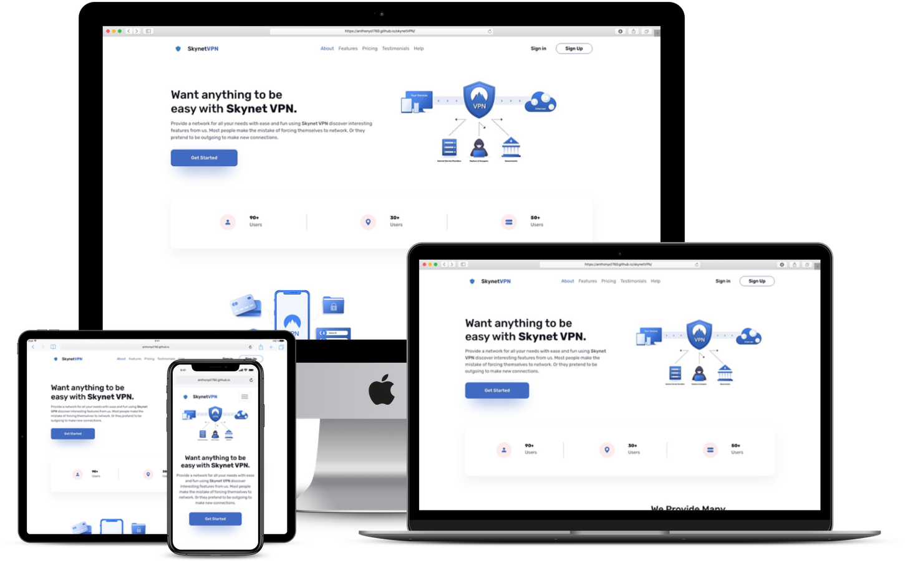

<!-- PROJECT LOGO -->
 

  

  <h3 align="center">Skynet VPN | secure connections anywhere in the world</h3>

  

   A good VPN service provides you a secure, encrypted tunnel for online traffic to flow. Nobody can see through the tunnel, get their hands on your online data, or find your real IP address and location. Skynet VPN is the best VPN if you’re looking for peace of mind when on public Wi-Fi.
     
    <a href="https://github.com/othneildrew/Best-README-Template"><strong>Explore the docs »</strong></a>
     
     
    <a href="https://anthonys1760.github.io/skynetVPN/index.html">View Demo</a>
    ·
    <a href="https://github.com/othneildrew/Best-README-Template/issues">Report Bug</a>
    ·
    <a href="https://github.com/othneildrew/Best-README-Template/issues">Request Feature</a>
  

<!-- ABOUT THE PROJECT -->
## About The Project

Secure your connections one day at a time.
### Built With:

* [HTML](https://nextjs.org/)
* [CSS](https://reactjs.org/)
* [JavaScript](https://vuejs.org/)
* [Bootstrap CSS](https://angular.io/)

(<a href="#top">back to top</a>)
